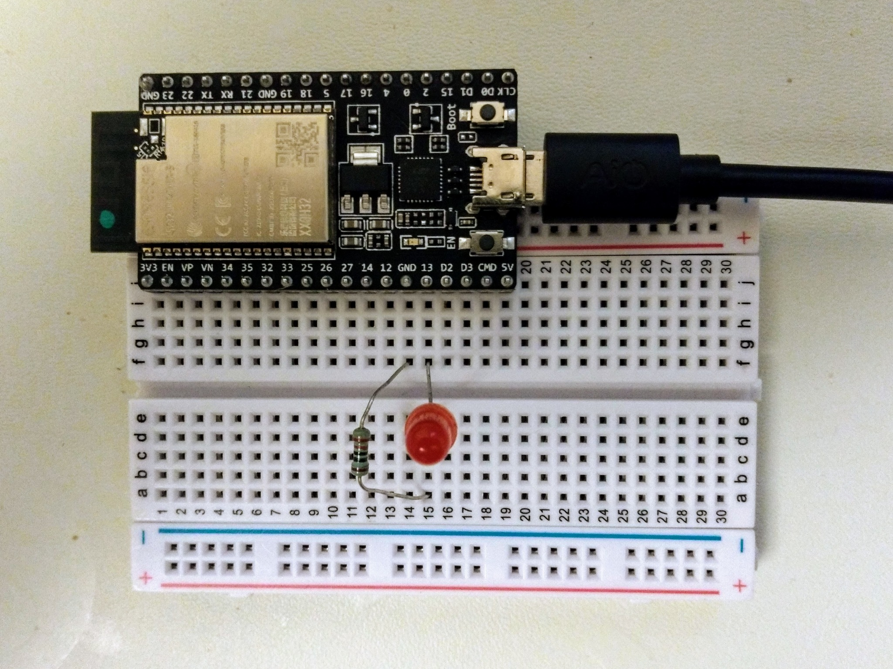

Setting up MicroPython on the ESP32 DevKitC VB
==============================================

Most ESP32 development boards feature the basic WROOM module, which has 4MiB of flash but just 520KiB of SRAM - which can be a little tight when running more substantial MicroPython programs.

An alternative to WROOM is the WROVER module that has an additional 4MiB of SRAM (to be technically correct, it's actually pSRAM).

Espressif produce a board, featuring this module, that's called the ESP32 DevKitC **VB** and is available from:

* [Mouser](https://www.mouser.com/ProductDetail/356-ESP32-DEVKITC-VB) for US$10.
* [Banggood](https://www.banggood.com/ESP32-DevkitC-Core-Board-ESP32-Development-Board-ESP32-WROOM-32U32D-F-VB-VIB-S1-p-1426780.html?ID=566841) for US$18

Note: the Banggood price includes shipping while the Mouser price does not (though Mouser do provide free shipping on orders over a certain size).

The following short guide covers getting MicroPython set up on the board and using it to blink an LED on and off as a simple example.

Setup
-----

Create a new directory for your project, then create and set up a standard Python venv:

    $ mkdir esp32-devkitc-vb
    $ cd esp32-devkitc-vb
    $ python3 -m venv env
    $ source env/bin/activate
    $ pip install --upgrade pip

Install the Espressif [`esptool`](https://github.com/espressif/esptool):

    $ pip install esptool

Go to the ESP32 section of the MicroPython [download page](https://micropython.org/download), if there are firmwares listed for multiple ESP-IDF then go to the section for the latest version (4.x at the time of writing) and then chose the GENERIC-SPIRAM firmare in this section for the latest MicroPython version (1.12 at the time of writing).

There are typically two versions, e.g.:

* GENERIC-SPIRAM : esp32spiram-idf4-20200309-v1.12-213-g8db5d2d1f.bin
* GENERIC-SPIRAM : esp32spiram-idf4-20191220-v1.12.bin

The one ending in `v1.12.bin` is the latest stable build, while the one ending in `v1.12-213-g8db5d2d1f.bin` is the latest nightly build and includes commits made since the last stable release. Usually it's best to go with the stable build.

Note: the plain GENERIC firmwares are for boards that just have the WROOM module while the GENERIC-SPIRAM firmwares are for boards that have the WROVER module with the addition 4MiB of SRAM.

Once you've downloaded the firmware, you need to write it to the board:

    $ FIRMWARE=~/Downloads/esp32spiram-idf4-20191220-v1.12.bin
    $ PORT=/dev/cp2104
    $ esptool.py --port $PORT erase_flash
    $ esptool.py --port $PORT write_flash -z 0x1000 $FIRMWARE

Install [`rshell`](https://github.com/dhylands/rshell) so you can interact with MicroPython:

    $ pip install rshell

Connect you board via USB and determine the serial device that corresponds to your board, typically this is `/dev/cu.SLAB_USBtoUART` on Mac and `/dev/ttyUSB0` on Linux.

Note: on Mac you will probably have to install a device driver for the CP2104 USB-to-UART bridge controller that the board uses. You can find the relevant driver on the [SiLabs CP2104 driver page](http://www.silabs.com/products/development-tools/software/usb-to-uart-bridge-vcp-drivers).

Then connect to the board like so:

    $ PORT=/dev/ttyUSB0
    $ rshell -p $PORT --buffer-size 512 --quiet
    > help
    ...

Button press example
--------------------

The board has two buttons - one called **EN**, that causes the board to do a hard reset, and the other called **BOOT**, that causes the board to enter a firmware download if held down while you press the EN button.

The BOOT button only has special behavior when used in combination with EN. When the board is running, it's just a normal button connected to GPIO pin 0. So you can use it for a simple MicroPython example program.

So assuming `rshell` is started, just use the `repl` command to access the MicroPython REPL:

    > repl
    Entering REPL. Use Control-X to exit.
    >>>

The REPL supports auto-ident - this works well when you're entering code by hand but when you try to paste in code that's already correctly indented, the auto-indent will cause the pasted code to be over indented. So to paste in code, you first need to enter paste mode by pressing `ctrl-E`. When you do this you'll see:

    paste mode; Ctrl-C to cancel, Ctrl-D to finish
    ===

Note: enter `help()` (when in normal mode) for a reminder of the various key bindings like `ctrl-E`.

Now you can copy and paste in the following code and then press `ctrl-D`, the code will start to run immediately:

```
button = machine.Pin(0, machine.Pin.IN, machine.Pin.PULL_UP)
prev = True
while True:
    now = button.value()
    if now != prev:
        print('Button', 'released' if now else 'pressed')
        prev = now
```

Press the BOOT button and the code will print `Button pressed` (and `Button released` when you release the button).

Notes:

* The button value is `False` when the button is pressed, which is maybe the opposite to what you'd expect.
* The code may print more often than you'd expect due to a phenomenon called [bounce](https://learn.adafruit.com/make-it-switch/debouncing) (though if you look at the [board schematic](https://dl.espressif.com/dl/schematics/esp32_devkitc_v4-sch.pdf), you'll see that the buttons have 0.1&micro;F capicitors in parallel which is a cheap mechanism for reducing bounce).

You can press `ctrl-C` to interrupt the running code and return to the MicroPython REPL prompt. And then press `ctrl-X` to return to the `rshell` prompt.

Example circuit
---------------

Let's create a simple circuit with an LED connected to pin 13 on the board:



The circuit consists of:

* A standard **5mm 20mA red LED** - its long leg (the positive anode) is on the top side of the central divide of the breadboard and is connected to pin 13 of the DevKit board, while its short leg (the negative cathode) is on the other side of the divide.
* A **220&ohm; resister** - its legs are inserted such that one is connected with the cathode of the LED and the other to the GND pin of the DevKit board.

Note: 220&ohm; is actually way higher than needed but its a common resistor type and will keep the current well below the safe level for the pins on the board.

Now lets create a simple program that flashes the LED on and off:

    $ cat > main.py << EOF
    import machine
    import time

    pin13 = machine.Pin(13, machine.Pin.OUT)
    on = 1
    while True:
        pin13.value(on)
        on ^= 1
        time.sleep(0.2)
    EOF

Let's copy it to the board and then connect to the MicroPython REPL:

    $ rshell -p $PORT --buffer-size 512 --quiet
    > cp main.py /pyboard
    > repl

If you now press the EN button on the board, you'll see it do a hard reset and start the program - the LED should blink on and off every 200ms.
